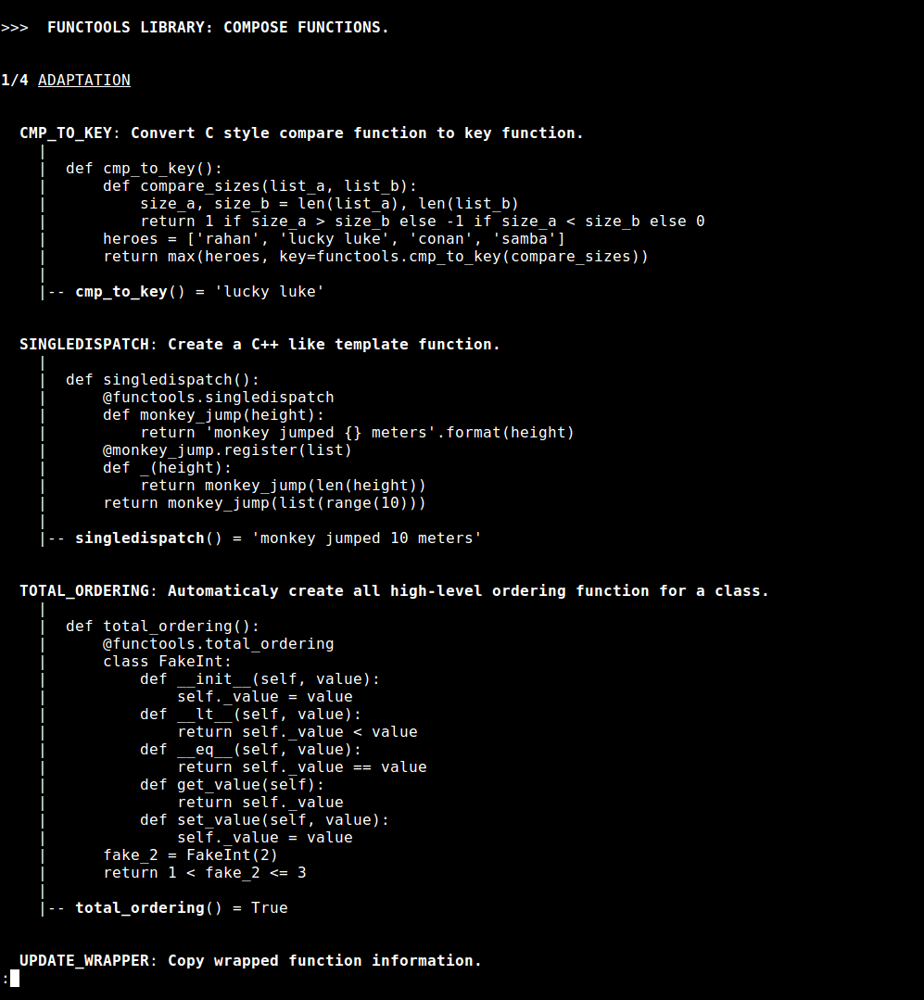

# pyhow [](https://travis-ci.org/yoeo/pyhow)
Learn python by playing with sample codes and become a guru... (one day in the far \_\_future\_\_)

## Description
**pyhow** is a collection of sample codes that uses and explains python core components.

You will find sample code for **built-in** functions classes, exceptions, obejcts and for some modules like **itertools**, **functools** etc...

### An example of output:


## How to use it?
### Requirements
The only requirements are **python** and **python-setuptools**.

### Install
You can install **pyhow** on your system or virtualenv:
```
python setup.py install
```

###Exemple
For exemple, to show Python regular expression samples
```
pyhow syntax.regex
```

###Help
Usage
```
pyhow <sample-name>
```
Help and available samples
```
usage: pyhow [-h]
             {builtin.exceptions,builtin.objects,builtin.warnings,impl.async,impl.classes,impl.convertibles,impl.functions,impl.iterables,impl.metaclasses,impl.operators,impl.serializables,lib.collections,lib.functools,lib.itertools,lib.re,lib.tempfile,syntax.regex,syntax.str_format}

Select one of the following samples:
  builtin.exceptions: generate and catch built-in exceptions.
  builtin.objects   : use and abuse python built-in objects, functions and classes.
  builtin.warnings  : trigger and handle built-in warnings.
  impl.async        : handle asynchronious operations.
  impl.classes      : play with class and object implementations.
  impl.convertibles : handle items conversion and value extraction.
  impl.functions    : create function-like objects.
  impl.iterables    : sequences implementation, create kind of iterators, lists, maps...
  impl.metaclasses  : tweak metaclasses, classes that generates classes.
  impl.operators    : implementation of python operators.
  impl.serializables: custom methods to copy, serialize and unserialize items.
  lib.collections   : collections library: tools to manage sequence of items.
  lib.functools     : functools library: compose functions.
  lib.itertools     : itertools library: create, mix and extract data from iterators.
  lib.re            : re library: extract information from text with regular expressions.
  lib.tempfile      : tempfile library: work with temporary files and directories.
  syntax.regex      : regular expressions language samples.
  syntax.str_format : string formating language samples.

positional arguments:
  {builtin.exceptions,builtin.objects,builtin.warnings,impl.async,impl.classes,impl.convertibles,impl.functions,impl.iterables,impl.metaclasses,impl.operators,impl.serializables,lib.collections,lib.functools,lib.itertools,lib.re,lib.tempfile,syntax.regex,syntax.str_format}

optional arguments:
  -h, --help            show this help message and exit
```

Have fun!
